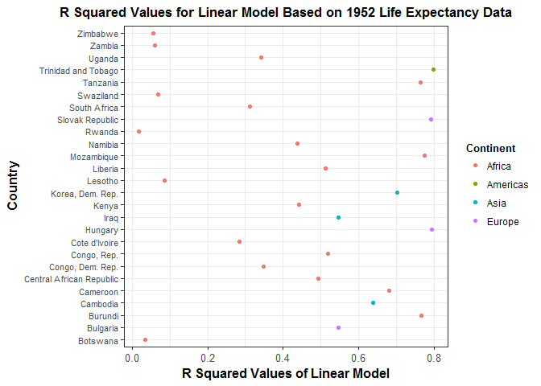
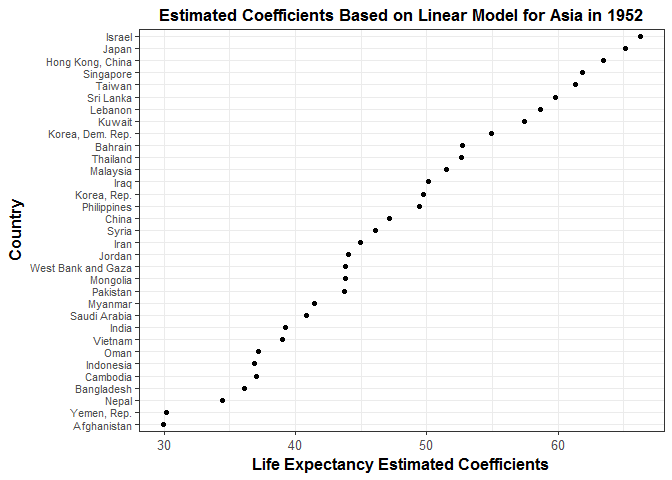
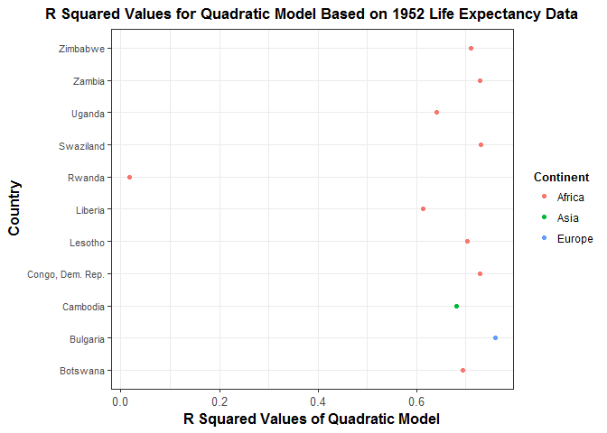
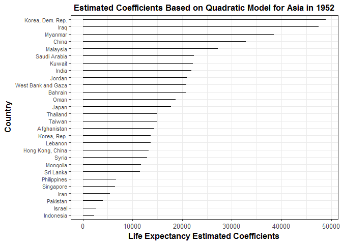

STAT 547 Homework Assignment \#6
================

[Return to Homework 6 Folder](https://github.com/heathersummers/STAT547-hw-Summers-Heather/tree/master/hw06)

[Return to Main Page of Repository](https://github.com/heathersummers/STAT547-hw-Summers-Heather)

Table of Contents:
------------------

-   [Working with a nested data frame](#working-with-a-nested-data-frame)

    -   [Linear Model](#linear-model)

    -   [Quadratic Model](#quadratic-model)

-   [Writing Functions](#writing-functions)

Load the following packages:

``` r
library(gapminder)
library(tidyverse)
library(broom)
library(forcats)
library(purrr)
library(robustbase)
```

Task 6:
-------

### Working with a nested data frame

#### Linear Model

<a href="#top">Back to top</a>

Creating a nested data frame and fitting a linear model of life expectancy against year. First, nest the data by country and continent.

``` r
#Nesting the data by country and continent:
nested_gapminder<- gapminder %>%
  group_by(continent, country) %>% #keeps country and continent on the outside
  nest()
head(nested_gapminder)
```

    ## # A tibble: 6 x 3
    ##   continent     country              data
    ##      <fctr>      <fctr>            <list>
    ## 1      Asia Afghanistan <tibble [12 x 4]>
    ## 2    Europe     Albania <tibble [12 x 4]>
    ## 3    Africa     Algeria <tibble [12 x 4]>
    ## 4    Africa      Angola <tibble [12 x 4]>
    ## 5  Americas   Argentina <tibble [12 x 4]>
    ## 6   Oceania   Australia <tibble [12 x 4]>

``` r
linear_fit <- function(dat, offset = 1952){
  lm(lifeExp ~ I(year - offset), data = dat)
}

linear_fit(nested_gapminder[[1, "data"]]) #model is fit to the data from Afghanistan
```

    ## 
    ## Call:
    ## lm(formula = lifeExp ~ I(year - offset), data = dat)
    ## 
    ## Coefficients:
    ##      (Intercept)  I(year - offset)  
    ##          29.9073            0.2753

``` r
(fits <- map(nested_gapminder$data[1:2], linear_fit))
```

    ## [[1]]
    ## 
    ## Call:
    ## lm(formula = lifeExp ~ I(year - offset), data = dat)
    ## 
    ## Coefficients:
    ##      (Intercept)  I(year - offset)  
    ##          29.9073            0.2753  
    ## 
    ## 
    ## [[2]]
    ## 
    ## Call:
    ## lm(formula = lifeExp ~ I(year - offset), data = dat)
    ## 
    ## Coefficients:
    ##      (Intercept)  I(year - offset)  
    ##          59.2291            0.3347

``` r
#`map()` inside `mutate()` in order to store the models inside the nested gapminder data set (`nested_gapminder`) in another list-column
(gapminder_coefficients <- nested_gapminder %>%
    mutate(fit = map(data, linear_fit),
           clean = map(fit, tidy)) %>%
  select(continent, country, clean) %>% 
  unnest(clean)) #unnest is used to simplify back to a normal tibble
```

    ## # A tibble: 284 x 7
    ##    continent     country             term   estimate   std.error
    ##       <fctr>      <fctr>            <chr>      <dbl>       <dbl>
    ##  1      Asia Afghanistan      (Intercept) 29.9072949 0.663999539
    ##  2      Asia Afghanistan I(year - offset)  0.2753287 0.020450934
    ##  3    Europe     Albania      (Intercept) 59.2291282 1.076844032
    ##  4    Europe     Albania I(year - offset)  0.3346832 0.033166387
    ##  5    Africa     Algeria      (Intercept) 43.3749744 0.718420236
    ##  6    Africa     Algeria I(year - offset)  0.5692797 0.022127070
    ##  7    Africa      Angola      (Intercept) 32.1266538 0.764035493
    ##  8    Africa      Angola I(year - offset)  0.2093399 0.023532003
    ##  9  Americas   Argentina      (Intercept) 62.6884359 0.158728938
    ## 10  Americas   Argentina I(year - offset)  0.2317084 0.004888791
    ## # ... with 274 more rows, and 2 more variables: statistic <dbl>,
    ## #   p.value <dbl>

Exploring the fit of the model using functions from the `broom` package:

``` r
#Tidy the data for `lm` objects produces a data frame summary of estimated coefficients and results related to statistical inference such as the p-value.
gfits_broom <- gapminder %>%
  group_by(country, continent) %>% 
  do(tidy(lm(lifeExp ~ I(year - 1952), data = .))) #`tidy()` is a tidy version of `summary()` and gives a table with one row per parameter estimate
gfits_broom
```

    ## # A tibble: 284 x 7
    ## # Groups:   country, continent [142]
    ##        country continent           term   estimate   std.error  statistic
    ##         <fctr>    <fctr>          <chr>      <dbl>       <dbl>      <dbl>
    ##  1 Afghanistan      Asia    (Intercept) 29.9072949 0.663999539  45.041138
    ##  2 Afghanistan      Asia I(year - 1952)  0.2753287 0.020450934  13.462890
    ##  3     Albania    Europe    (Intercept) 59.2291282 1.076844032  55.002513
    ##  4     Albania    Europe I(year - 1952)  0.3346832 0.033166387  10.091036
    ##  5     Algeria    Africa    (Intercept) 43.3749744 0.718420236  60.375491
    ##  6     Algeria    Africa I(year - 1952)  0.5692797 0.022127070  25.727749
    ##  7      Angola    Africa    (Intercept) 32.1266538 0.764035493  42.048641
    ##  8      Angola    Africa I(year - 1952)  0.2093399 0.023532003   8.895964
    ##  9   Argentina  Americas    (Intercept) 62.6884359 0.158728938 394.940184
    ## 10   Argentina  Americas I(year - 1952)  0.2317084 0.004888791  47.395847
    ## # ... with 274 more rows, and 1 more variables: p.value <dbl>

``` r
#Can use several other functions from the `broom` package but it is more convient to first store the fitted model as an object (ex. `fits`).
(fits <- gapminder %>%
  group_by(country, continent) %>% 
  do(fit = lm(lifeExp ~ I(year - 1952), .)))
```

    ## Source: local data frame [142 x 3]
    ## Groups: <by row>
    ## 
    ## # A tibble: 142 x 3
    ##        country continent      fit
    ##  *      <fctr>    <fctr>   <list>
    ##  1 Afghanistan      Asia <S3: lm>
    ##  2     Albania    Europe <S3: lm>
    ##  3     Algeria    Africa <S3: lm>
    ##  4      Angola    Africa <S3: lm>
    ##  5   Argentina  Americas <S3: lm>
    ##  6   Australia   Oceania <S3: lm>
    ##  7     Austria    Europe <S3: lm>
    ##  8     Bahrain      Asia <S3: lm>
    ##  9  Bangladesh      Asia <S3: lm>
    ## 10     Belgium    Europe <S3: lm>
    ## # ... with 132 more rows

``` r
fits %>%
  glance(fit) #one row per country and it provides statistics on the overall model inclduing the R squared value and adjusted R squared value.
```

    ## # A tibble: 142 x 13
    ## # Groups:   country, continent [142]
    ##        country continent r.squared adj.r.squared     sigma  statistic
    ##         <fctr>    <fctr>     <dbl>         <dbl>     <dbl>      <dbl>
    ##  1 Afghanistan      Asia 0.9477123     0.9424835 1.2227880  181.24941
    ##  2     Albania    Europe 0.9105778     0.9016355 1.9830615  101.82901
    ##  3     Algeria    Africa 0.9851172     0.9836289 1.3230064  661.91709
    ##  4      Angola    Africa 0.8878146     0.8765961 1.4070091   79.13818
    ##  5   Argentina  Americas 0.9955681     0.9951249 0.2923072 2246.36635
    ##  6   Australia   Oceania 0.9796477     0.9776125 0.6206086  481.34586
    ##  7     Austria    Europe 0.9921340     0.9913474 0.4074094 1261.29629
    ##  8     Bahrain      Asia 0.9667398     0.9634138 1.6395865  290.65974
    ##  9  Bangladesh      Asia 0.9893609     0.9882970 0.9766908  929.92637
    ## 10     Belgium    Europe 0.9945406     0.9939946 0.2929025 1821.68840
    ## # ... with 132 more rows, and 7 more variables: p.value <dbl>, df <int>,
    ## #   logLik <dbl>, AIC <dbl>, BIC <dbl>, deviance <dbl>, df.residual <int>

``` r
fits %>% 
  augment(fit) #one row per original observation and it gives several summary statistics including fitted value, residual, Cook's D, etc.
```

    ## # A tibble: 1,704 x 11
    ## # Groups:   country, continent [142]
    ##        country continent lifeExp I.year...1952.  .fitted   .se.fit
    ##         <fctr>    <fctr>   <dbl>          <dbl>    <dbl>     <dbl>
    ##  1 Afghanistan      Asia  28.801              0 29.90729 0.6639995
    ##  2 Afghanistan      Asia  30.332              5 31.28394 0.5799442
    ##  3 Afghanistan      Asia  31.997             10 32.66058 0.5026799
    ##  4 Afghanistan      Asia  34.020             15 34.03722 0.4358337
    ##  5 Afghanistan      Asia  36.088             20 35.41387 0.3848726
    ##  6 Afghanistan      Asia  38.438             25 36.79051 0.3566719
    ##  7 Afghanistan      Asia  39.854             30 38.16716 0.3566719
    ##  8 Afghanistan      Asia  40.822             35 39.54380 0.3848726
    ##  9 Afghanistan      Asia  41.674             40 40.92044 0.4358337
    ## 10 Afghanistan      Asia  41.763             45 42.29709 0.5026799
    ## # ... with 1,694 more rows, and 5 more variables: .resid <dbl>,
    ## #   .hat <dbl>, .sigma <dbl>, .cooksd <dbl>, .std.resid <dbl>

Exploring the R squared values of the linear model:

Analyzed which countries had an R squared value less than 0.8 when fitting the linear model of life expectancy against the year 1952.

``` r
(fits %>% 
  glance(fit) %>%
  filter(r.squared<0.8) %>% 
  ggplot(aes(x=r.squared, y=country, colour = continent)) +
  geom_point() +
  scale_x_continuous ("R Squared Values of Linear Model") +
  labs(title = "R Squared Values for Linear Model Based on 1952 Life Expectancy Data", y = "Country", colour = "Continent") +
   theme_bw()+
   theme(axis.title = element_text(size = 12, face ="bold"),
         axis.text.x = element_text(size = 10),
         axis.text.y = element_text(size = 8),
         plot.title = element_text(size = 13, face = "bold", hjust = 0.5),
         legend.title = element_text(size = 10, face = "bold")))
```



Exploring the estimated coefficients:

``` r
(estimate_coef <- gapminder_coefficients %>%
   mutate(country = fct_reorder(country, estimate)) %>%
   filter(continent=="Asia", (estimate>1)) %>%
   ggplot(aes(x = estimate, y = country)) +
   geom_point() +
   scale_x_continuous ("Life Expectancy Estimated Coefficients") +
   labs(title = "Estimated Coefficients Based on Linear Model for Asia in 1952", y = "Country") +
   theme_bw()+
   theme(axis.title = element_text(size = 12, face ="bold"),
         axis.text.x = element_text(size = 10),
         axis.text.y = element_text(size = 8),
         plot.title = element_text(size = 13, face = "bold", hjust = 0.5)))
```



#### Quadratic Model

<a href="#top">Back to top</a>

Using the nested data frame and fitting a quadratic model of life expectancy against year.

``` r
quad_fit <- function(dat, offset = 1952){
  lm(lifeExp ~ I(year - offset) + I(year^2), data = dat)
}
quad_fit(nested_gapminder[[1, "data"]]) #model is fit to the data from Afghanistan
```

    ## 
    ## Call:
    ## lm(formula = lifeExp ~ I(year - offset) + I(year^2), data = dat)
    ## 
    ## Coefficients:
    ##      (Intercept)  I(year - offset)         I(year^2)  
    ##        1.440e+04         1.521e+01        -3.772e-03

``` r
(quadfits <- map(nested_gapminder$data[1:2], quad_fit))
```

    ## [[1]]
    ## 
    ## Call:
    ## lm(formula = lifeExp ~ I(year - offset) + I(year^2), data = dat)
    ## 
    ## Coefficients:
    ##      (Intercept)  I(year - offset)         I(year^2)  
    ##        1.440e+04         1.521e+01        -3.772e-03  
    ## 
    ## 
    ## [[2]]
    ## 
    ## Call:
    ## lm(formula = lifeExp ~ I(year - offset) + I(year^2), data = dat)
    ## 
    ## Coefficients:
    ##      (Intercept)  I(year - offset)         I(year^2)  
    ##        1.981e+04         2.086e+01        -5.184e-03

``` r
(gapminder_coefficients <- nested_gapminder %>%
    mutate(fitted = map(data, quad_fit),
           tidy = map(fitted, tidy)) %>%
  select(continent, country, tidy) %>%
  unnest(tidy))
```

    ## # A tibble: 426 x 7
    ##    continent     country             term      estimate    std.error
    ##       <fctr>      <fctr>            <chr>         <dbl>        <dbl>
    ##  1      Asia Afghanistan      (Intercept)  1.439877e+04 2.442902e+03
    ##  2      Asia Afghanistan I(year - offset)  1.520673e+01 2.538560e+00
    ##  3      Asia Afghanistan        I(year^2) -3.771508e-03 6.412076e-04
    ##  4    Europe     Albania      (Intercept)  1.980942e+04 5.717525e+03
    ##  5    Europe     Albania I(year - offset)  2.085808e+01 5.941409e+00
    ##  6    Europe     Albania        I(year^2) -5.183986e-03 1.500724e-03
    ##  7    Africa     Algeria      (Intercept)  1.195285e+04 4.252233e+03
    ##  8    Africa     Algeria I(year - offset)  1.294501e+01 4.418740e+00
    ##  9    Africa     Algeria        I(year^2) -3.125974e-03 1.116117e-03
    ## 10    Africa      Angola      (Intercept)  1.673158e+04 2.699828e+03
    ## # ... with 416 more rows, and 2 more variables: statistic <dbl>,
    ## #   p.value <dbl>

``` r
(quadfits <- gapminder %>%
  group_by(country, continent) %>% 
  do(fit2 = lm(lifeExp ~ I(year - 1952)+ I(year^2), .)))
```

    ## Source: local data frame [142 x 3]
    ## Groups: <by row>
    ## 
    ## # A tibble: 142 x 3
    ##        country continent     fit2
    ##  *      <fctr>    <fctr>   <list>
    ##  1 Afghanistan      Asia <S3: lm>
    ##  2     Albania    Europe <S3: lm>
    ##  3     Algeria    Africa <S3: lm>
    ##  4      Angola    Africa <S3: lm>
    ##  5   Argentina  Americas <S3: lm>
    ##  6   Australia   Oceania <S3: lm>
    ##  7     Austria    Europe <S3: lm>
    ##  8     Bahrain      Asia <S3: lm>
    ##  9  Bangladesh      Asia <S3: lm>
    ## 10     Belgium    Europe <S3: lm>
    ## # ... with 132 more rows

``` r
quadfits %>%
  glance(fit2) #one row per country and it provides statistics on the overall model inclduing the R squared value and adjusted R squared value.
```

    ## # A tibble: 142 x 13
    ## # Groups:   country, continent [142]
    ##        country continent r.squared adj.r.squared     sigma statistic
    ##         <fctr>    <fctr>     <dbl>         <dbl>     <dbl>     <dbl>
    ##  1 Afghanistan      Asia 0.9892058     0.9868071 0.5856324  412.3908
    ##  2     Albania    Europe 0.9615523     0.9530084 1.3706518  112.5422
    ##  3     Algeria    Africa 0.9920480     0.9902809 1.0193800  561.3969
    ##  4      Angola    Africa 0.9786354     0.9738877 0.6472248  206.1286
    ##  5   Argentina  Americas 0.9955863     0.9946055 0.3074846 1015.0580
    ##  6   Australia   Oceania 0.9927021     0.9910804 0.3917319  612.1164
    ##  7     Austria    Europe 0.9946153     0.9934187 0.3553153  831.2012
    ##  8     Bahrain      Asia 0.9973157     0.9967192 0.4909855 1671.8960
    ##  9  Bangladesh      Asia 0.9972774     0.9966723 0.5208071 1648.3149
    ## 10     Belgium    Europe 0.9957497     0.9948052 0.2724181 1054.2560
    ## # ... with 132 more rows, and 7 more variables: p.value <dbl>, df <int>,
    ## #   logLik <dbl>, AIC <dbl>, BIC <dbl>, deviance <dbl>, df.residual <int>

``` r
quadfits %>% 
  augment(fit2) #one row per original observation and it gives several summary statistics including fitted value, residual, Cook's D, etc.
```

    ## # A tibble: 1,704 x 12
    ## # Groups:   country, continent [142]
    ##        country continent lifeExp I.year...1952. I.year.2.  .fitted
    ##         <fctr>    <fctr>   <dbl>          <dbl>     <dbl>    <dbl>
    ##  1 Afghanistan      Asia  28.801              0   3810304 28.17869
    ##  2 Afghanistan      Asia  30.332              5   3829849 30.49821
    ##  3 Afghanistan      Asia  31.997             10   3849444 32.62915
    ##  4 Afghanistan      Asia  34.020             15   3869089 34.57152
    ##  5 Afghanistan      Asia  36.088             20   3888784 36.32532
    ##  6 Afghanistan      Asia  38.438             25   3908529 37.89053
    ##  7 Afghanistan      Asia  39.854             30   3928324 39.26718
    ##  8 Afghanistan      Asia  40.822             35   3948169 40.45525
    ##  9 Afghanistan      Asia  41.674             40   3968064 41.45474
    ## 10 Afghanistan      Asia  41.763             45   3988009 42.26566
    ## # ... with 1,694 more rows, and 6 more variables: .se.fit <dbl>,
    ## #   .resid <dbl>, .hat <dbl>, .sigma <dbl>, .cooksd <dbl>,
    ## #   .std.resid <dbl>

Exploring the R squared values of the quadratic model:

Analyzed which countries had an R squared value less than 0.8 when fitting the quadratic model of life expectancy against the year 1952.

``` r
(quadfits %>% 
  glance(fit2) %>%
  filter(r.squared<0.8) %>% 
  ggplot(aes(x=r.squared, y=country, colour = continent)) +
  geom_point() +
  scale_x_continuous ("R Squared Values of Quadratic Model") +
  labs(title = "R Squared Values for Quadratic Model Based on 1952 Life Expectancy Data", y = "Country", colour = "Continent") +
   theme_bw()+
   theme(axis.title = element_text(size = 12, face ="bold"),
         axis.text.x = element_text(size = 10),
         axis.text.y = element_text(size = 8),
         plot.title = element_text(size = 13, face = "bold", hjust = 0.5),
         legend.title = element_text(size = 10, face = "bold")))
```



Based on the figures of R squared values, it appears the quadratic model is a better fit of the nested data (i.e. less countries than have an R squared value less than 0.8).

Exploring the estimated coefficients:

``` r
(estimate_coef <- gapminder_coefficients %>%
   mutate(country = fct_reorder(country, estimate)) %>%
   filter(continent=="Asia", (estimate>1)) %>%
   ggplot(aes(x = estimate, y = country)) +
   geom_line() +
   scale_x_continuous ("Life Expectancy Estimated Coefficients") +
   labs(title = "Estimated Coefficients Based on Quadratic Model for Asia in 1952", y = "Country") +
   theme_bw()+
   theme(axis.title = element_text(size = 12, face ="bold"),
         axis.text.x = element_text(size = 10),
         axis.text.y = element_text(size = 8),
         plot.title = element_text(size = 13, face = "bold", hjust = 0.5)))
```



Task 2:
-------

### Writing Functions

<a href="#top">Back to top</a>

The goal of this function is for a linear regression function to be generalized to do a quadratic regresion and a robust regression (`lmrob()`).

First, I nested the data by country.

``` r
gap_nested <- gapminder %>%
  group_by(country) %>% #keeps country on the outside
  nest()
head(gap_nested)
```

    ## # A tibble: 6 x 2
    ##       country              data
    ##        <fctr>            <list>
    ## 1 Afghanistan <tibble [12 x 5]>
    ## 2     Albania <tibble [12 x 5]>
    ## 3     Algeria <tibble [12 x 5]>
    ## 4      Angola <tibble [12 x 5]>
    ## 5   Argentina <tibble [12 x 5]>
    ## 6   Australia <tibble [12 x 5]>

If robust is used than `robust` will be equal to 1 and if it is not used it will be equal to 0. If it is a linear regression function than `model` will be equal to 1 and if it is a quadratic regression function than `model` will be equal to 2.

``` r
#linear function: lm(gdpPercap ~ I(year - offset)
#quadratic function: lm(gdpPercap ~ I(year - offset) + I(year^2)

fit_model <- function(data, offset = 2007, robust = 1, model = 2){
  if(robust==1) lmrob(gdpPercap ~ I(year - offset) + I(year^2*model), data = data, control = lmrob.control(max.it = 100)) else
    lm(gdpPercap ~ I(year - offset) + I(year^2*model), data = data)
}

#lin_fit_norob = linear fit without robust
#lin_fit_rob = linear fit with robust
#quad_fit_norob = quadratic fit without robust
#quad_fit_rob = quadratic fit with robust

gap_nested <- gap_nested %>%
  mutate(lin_fit_norob = map(data, fit_model, 0, 1), #map is used for doing computations involving list columns
         lin_fit_rob = map(data, fit_model, 1, 2),
         quad_fit_norob = map(data, fit_model, 0, 1),
         quad_fit_rob = map(data, fit_model, 1, 2))
head(gap_nested)
```

    ## # A tibble: 6 x 6
    ##       country              data lin_fit_norob lin_fit_rob quad_fit_norob
    ##        <fctr>            <list>        <list>      <list>         <list>
    ## 1 Afghanistan <tibble [12 x 5]>   <S3: lmrob>    <S3: lm>    <S3: lmrob>
    ## 2     Albania <tibble [12 x 5]>   <S3: lmrob>    <S3: lm>    <S3: lmrob>
    ## 3     Algeria <tibble [12 x 5]>   <S3: lmrob>    <S3: lm>    <S3: lmrob>
    ## 4      Angola <tibble [12 x 5]>   <S3: lmrob>    <S3: lm>    <S3: lmrob>
    ## 5   Argentina <tibble [12 x 5]>   <S3: lmrob>    <S3: lm>    <S3: lmrob>
    ## 6   Australia <tibble [12 x 5]>   <S3: lmrob>    <S3: lm>    <S3: lmrob>
    ## # ... with 1 more variables: quad_fit_rob <list>

Report Your Process:
--------------------

<a href="#top">Back to top</a>

I first started doing task \#3 but struggled with understanding the `stringr` package including how to clean the "non-word" text using various characters. I used the notes from past STAT545 classes but still found it difficult so I have left that for another time. I struggled with finding notes and websites that were helpful for writing functions but did find several useful links when I was working with the nested data frame (see below). Overall, I found this assignment much harder and more time consuming than any of the previous assignments.

Useful Links:

[Fitting a Quadratic Model](http://www.theanalysisfactor.com/r-tutorial-4/)

[Computing by groups within data.frames with dplyr and broom](http://stat545.com/block023_dplyr-do.html)

[broom package](https://github.com/tidyverse/broom)

[Split-Apply-Combine](http://stat545.com/block024_group-nest-split-map.html)

[Robust regression](https://stats.idre.ucla.edu/r/dae/robust-regression/)

[Linear regression models with robust parameter estimation](https://www.r-bloggers.com/linear-regression-models-with-robust-parameter-estimation/)

<a href="#top">Back to top</a>
