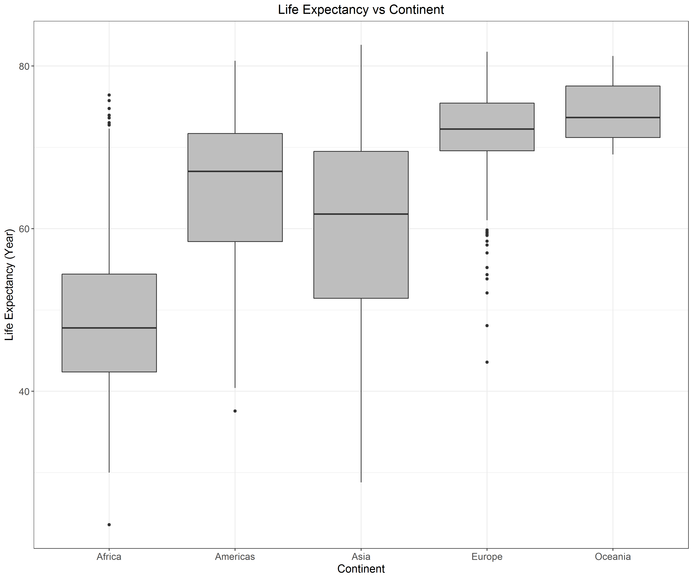
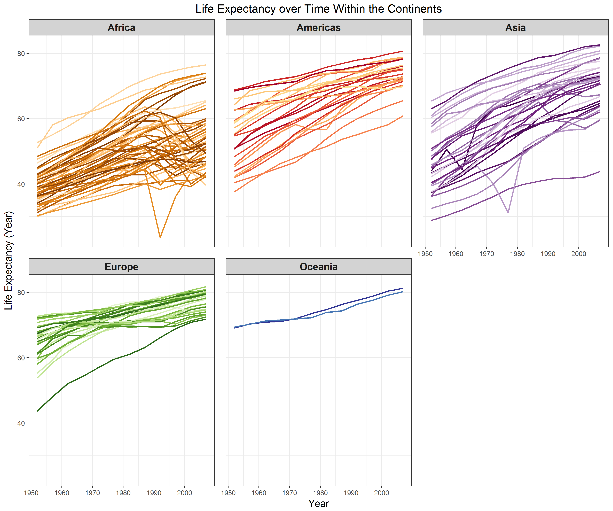
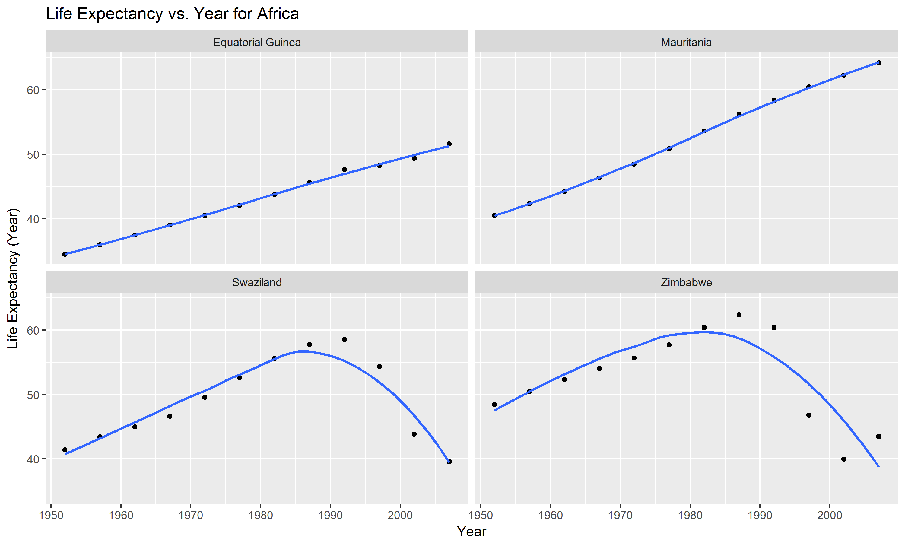
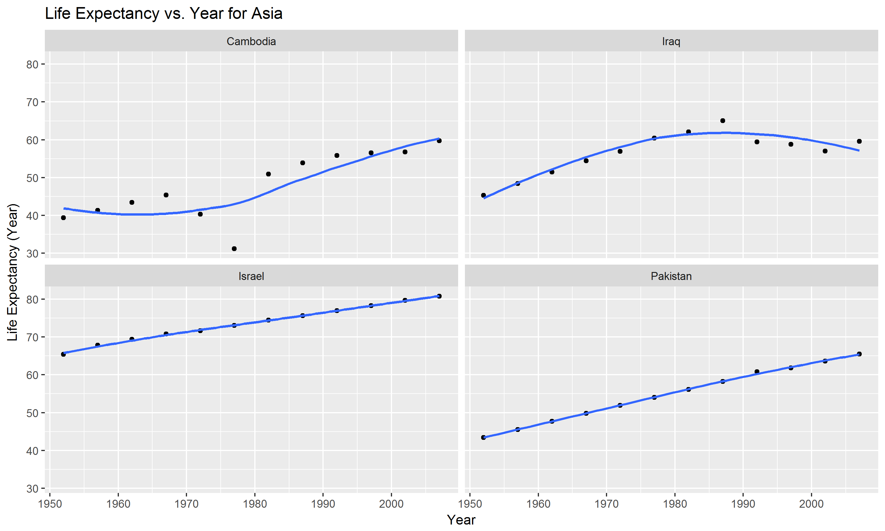
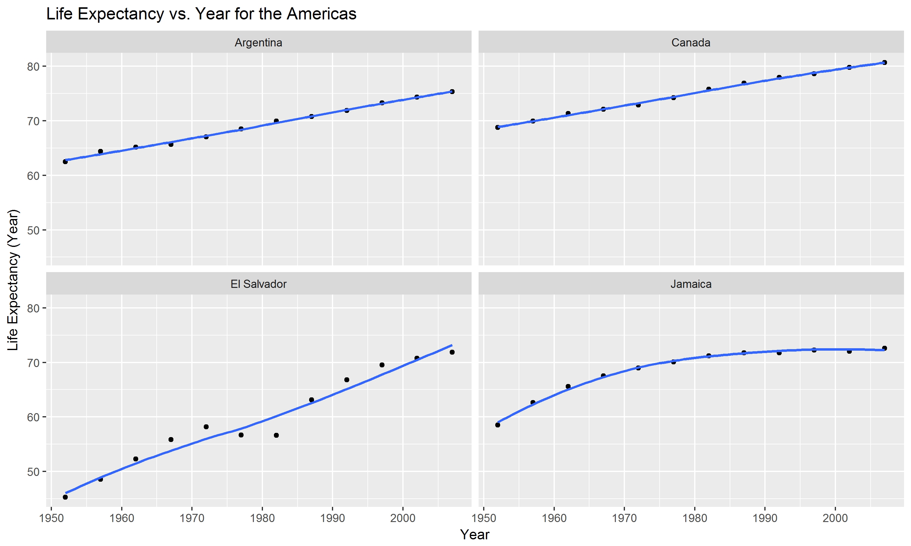
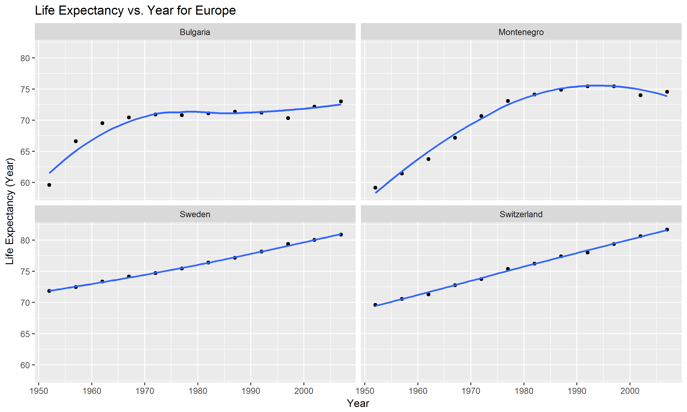
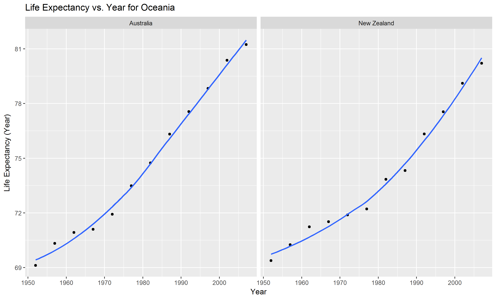

[Return to Homework 7 Folder](https://github.com/heathersummers/STAT547-hw-Summers-Heather/tree/master/hw07)

[Return to Main Page of Repository](https://github.com/heathersummers/STAT547-hw-Summers-Heather)

## Table of Contents:

- [Download the data](#download-the-data)

- [Descriptive plots](#descriptive-plots)

- [Perform exploratory analyses](#perform-exploratory-analyses)

- [Perform statistical analyses](#perform-statistical-analyses)

- [Generate figures](#generate-figures)

- [Automate the pipeline](#automate-the-pipeline)


Load the following packages:
```{r results='hide', message=FALSE, warning=FALSE}
library(tidyverse)
library(broom)
library(ggplot2)
library(dplyr)
library(forcats)
```


## Download the data
```{r}
library(downloader)
download.file(url = "https://raw.githubusercontent.com/jennybc/gapminder/master/inst/extdata/gapminder.tsv", destfile="gapminder.tsv")
```

## Descriptive plots

<a href="#top">Back to top</a>





## Perform exploratory analyses

<a href="#top">Back to top</a>

For this section I reordered continents based on life expectancy and arranged the data on continent, country, life expectancy, year. More details regarding the code can be found [here](https://github.com/heathersummers/STAT547-hw-Summers-Heather/blob/master/hw07/R%20scripts/gapminder_exploratory.R).
```{r}
gap_data <- read.delim("gapminder_clean.tsv")
(table <- head(as.data.frame(gap_data), n=10))
```

## Perform statistical analyses

<a href="#top">Back to top</a>

For this section I fit a linear regression of life expectancy on year within each country and got the estimated intercepts, slopes, and residual error variance (or sd). More details regarding the code can be found [here](https://github.com/heathersummers/STAT547-hw-Summers-Heather/blob/master/hw07/R%20scripts/gapminder_statistical.R). 
```{r}
coefficients_data<-read.delim("gap_coefficients.tsv")
(table <- head(as.data.frame(coefficients_data), n=10))
```

I also found the four "worst" and "best" countries for each continent (except Oceania since there are not enough countries available) based on the standard error. Standard error measures the accuracy with which a sample represents a population. The smaller the standard error (i.e. smaller the spread) the higher the accuracy of the sample, the data is more representative of the true mean. The larger the standard error the less accurate the sample, the data likely has notable irregularities. More details regarding the code can be found [here](https://github.com/heathersummers/STAT547-hw-Summers-Heather/blob/master/hw07/R%20scripts/gapminder_statistical.R).

```{r}
best_worst_countries<-read.delim("best_worst_countries.tsv")
(table<-as.data.frame(best_worst_countries))
```


## Generate figures

<a href="#top">Back to top</a>

For each continent I created a life expectancy vs. year for the two best countries (i.e. smallest std.error) and two worst countries (i.e. largest std.error). More details regarding the code can be found [here](https://github.com/heathersummers/STAT547-hw-Summers-Heather/blob/master/hw07/R%20scripts/gapminder_figures.R).








## Automate the pipeline

<a href="#top">Back to top</a>

I wrote a [Makefile](https://github.com/heathersummers/STAT547-hw-Summers-Heather/blob/master/hw07/R%20scripts/Makefile.R) to automate my pipeline using R and also saved rendered my [RMarkdown](https://github.com/heathersummers/STAT547-hw-Summers-Heather/blob/master/hw07/hw07.Rmd) report into [HTML format](https://github.com/heathersummers/STAT547-hw-Summers-Heather/blob/master/hw07/hw07.html).

