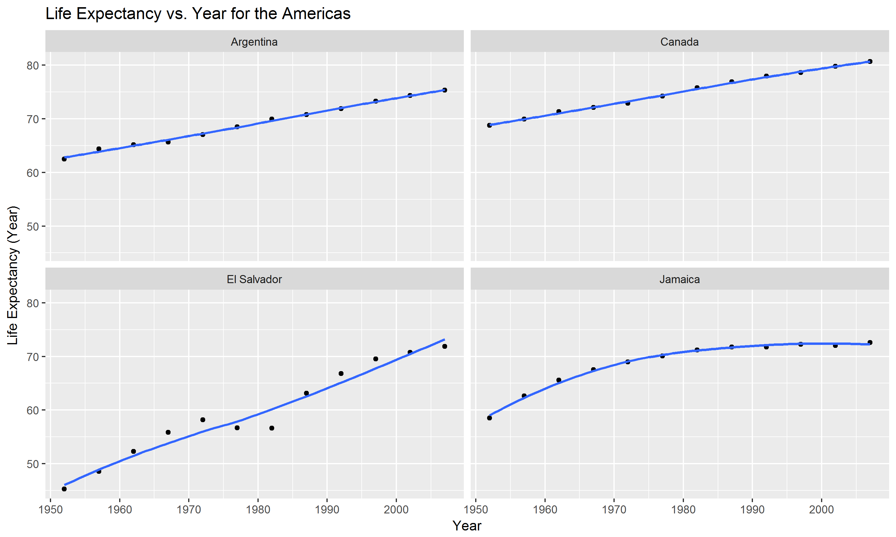
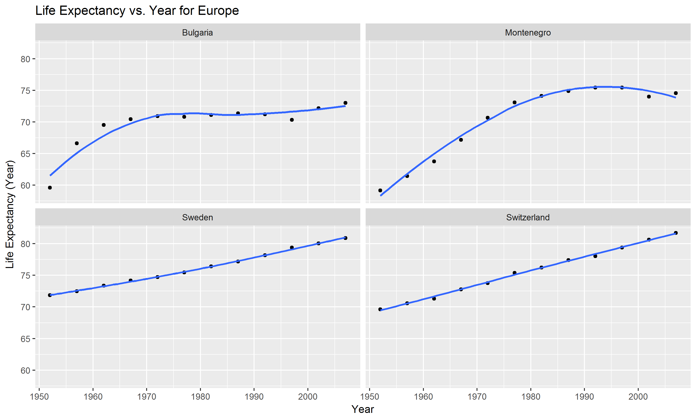

STAT 547 Homework Assignment \#7
================

[Return to Homework 7 Folder](https://github.com/heathersummers/STAT547-hw-Summers-Heather/tree/master/hw07)

[Return to Main Page of Repository](https://github.com/heathersummers/STAT547-hw-Summers-Heather)

Table of Contents:
------------------

-   [Download the data](#download-the-data)

-   [Descriptive plots](#descriptive-plots)

-   [Perform exploratory analyses](#perform-exploratory-analyses)

-   [Perform statistical analyses](#perform-statistical-analyses)

-   [Generate figures](#generate-figures)

-   [Automate the pipeline](#automate-the-pipeline)

Load the following packages:

``` r
library(tidyverse)
library(broom)
library(ggplot2)
library(dplyr)
library(forcats)
```

Download the data
-----------------

``` r
library(downloader)
download.file(url = "https://raw.githubusercontent.com/jennybc/gapminder/master/inst/extdata/gapminder.tsv", destfile="gapminder.tsv")
```

Descriptive plots
-----------------

<a href="#top">Back to top</a>


Perform exploratory analyses
----------------------------

<a href="#top">Back to top</a>

For this section I reordered continents based on life expectancy and arranged the data on continent, country, life expectancy, year. More details regarding the code can be found [here](https://github.com/heathersummers/STAT547-hw-Summers-Heather/blob/master/hw07/R%20scripts/gapminder_exploratory.R).

``` r
gap_data <- read.delim("gapminder_clean.tsv")
(table <- head(as.data.frame(gap_data), n=10))
```

    ##    continent country lifeExp year
    ## 1     Africa Algeria  43.077 1952
    ## 2     Africa Algeria  45.685 1957
    ## 3     Africa Algeria  48.303 1962
    ## 4     Africa Algeria  51.407 1967
    ## 5     Africa Algeria  54.518 1972
    ## 6     Africa Algeria  58.014 1977
    ## 7     Africa Algeria  61.368 1982
    ## 8     Africa Algeria  65.799 1987
    ## 9     Africa Algeria  67.744 1992
    ## 10    Africa Algeria  69.152 1997

Perform statistical analyses
----------------------------

<a href="#top">Back to top</a>

For this section I fit a linear regression of life expectancy on year within each country and got the estimated intercepts, slopes, and residual error variance (or sd). More details regarding the code can be found [here](https://github.com/heathersummers/STAT547-hw-Summers-Heather/blob/master/hw07/R%20scripts/gapminder_statistical.R).

``` r
coefficients_data<-read.delim("gap_coefficients.tsv")
(table <- head(as.data.frame(coefficients_data), n=10))
```

    ##    continent.x      country           term    estimate  std.error
    ## 1       Africa      Algeria    (Intercept) 43.37497436 0.71842024
    ## 2       Africa      Algeria I(year - 1952)  0.56927972 0.02212707
    ## 3       Africa       Angola    (Intercept) 32.12665385 0.76403549
    ## 4       Africa       Angola I(year - 1952)  0.20933986 0.02353200
    ## 5       Africa        Benin    (Intercept) 39.58851282 0.63788186
    ## 6       Africa        Benin I(year - 1952)  0.33423287 0.01964652
    ## 7       Africa     Botswana    (Intercept) 52.92911538 3.31904058
    ## 8       Africa     Botswana I(year - 1952)  0.06066853 0.10222519
    ## 9       Africa Burkina Faso    (Intercept) 34.68469231 1.11161365
    ## 10      Africa Burkina Faso I(year - 1952)  0.36397483 0.03423728
    ##     statistic      p.value continent.y       sd
    ## 1  60.3754908 3.776075e-14      Africa 1.323006
    ## 2  25.7277493 1.808143e-10      Africa 1.323006
    ## 3  42.0486406 1.387888e-12      Africa 1.407009
    ## 4   8.8959644 4.593498e-06      Africa 1.407009
    ## 5  62.0624528 2.868468e-14      Africa 1.174691
    ## 6  17.0123200 1.037138e-08      Africa 1.174691
    ## 7  15.9471131 1.938611e-08      Africa 6.112177
    ## 8   0.5934793 5.660414e-01      Africa 6.112177
    ## 9  31.2021109 2.684840e-11      Africa 2.047091
    ## 10 10.6309510 9.047506e-07      Africa 2.047091

I also found the four "worst" and "best" countries for each continent (except Oceania since there are not enough countries available) based on the standard error. Standard error measures the accuracy with which a sample represents a population. The smaller the standard error (i.e. smaller the spread) the higher the accuracy of the sample, the data is more representative of the true mean. The larger the standard error the less accurate the sample, the data likely has notable irregularities. More details regarding the code can be found [here](https://github.com/heathersummers/STAT547-hw-Summers-Heather/blob/master/hw07/R%20scripts/gapminder_statistical.R).

``` r
best_worst_countries<-read.delim("best_worst_countries.tsv")
(table<-as.data.frame(best_worst_countries))
```

    ##    continent.x                country           term   estimate
    ## 1       Africa      Equatorial Guinea I(year - 1952)  0.3101706
    ## 2       Africa             Mauritania I(year - 1952)  0.4464175
    ## 3       Africa                Comoros I(year - 1952)  0.4503909
    ## 4       Africa                   Mali I(year - 1952)  0.3768098
    ## 5       Africa               Botswana    (Intercept) 52.9291154
    ## 6       Africa                 Rwanda    (Intercept) 42.7419487
    ## 7       Africa              Swaziland    (Intercept) 46.3878590
    ## 8       Africa               Zimbabwe    (Intercept) 55.2212436
    ## 9         Asia                 Israel I(year - 1952)  0.2671063
    ## 10        Asia               Pakistan I(year - 1952)  0.4057923
    ## 11        Asia              Indonesia I(year - 1952)  0.6346413
    ## 12        Asia                   Iran I(year - 1952)  0.4966399
    ## 13        Asia                  China    (Intercept) 47.1904815
    ## 14        Asia       Korea, Dem. Rep.    (Intercept) 54.9056026
    ## 15        Asia                   Iraq    (Intercept) 50.1134615
    ## 16        Asia               Cambodia    (Intercept) 37.0154231
    ## 17    Americas                 Canada I(year - 1952)  0.2188692
    ## 18    Americas              Argentina I(year - 1952)  0.2317084
    ## 19    Americas                 Brazil I(year - 1952)  0.3900895
    ## 20    Americas               Paraguay I(year - 1952)  0.1573545
    ## 21    Americas    Trinidad and Tobago    (Intercept) 62.0523077
    ## 22    Americas                   Cuba    (Intercept) 62.2134487
    ## 23    Americas            El Salvador    (Intercept) 46.5119487
    ## 24    Americas                Jamaica    (Intercept) 62.6609872
    ## 25      Europe                 Sweden I(year - 1952)  0.1662545
    ## 26      Europe            Switzerland I(year - 1952)  0.2222315
    ## 27      Europe                 France I(year - 1952)  0.2385014
    ## 28      Europe                Belgium I(year - 1952)  0.2090846
    ## 29      Europe                Albania    (Intercept) 59.2291282
    ## 30      Europe Bosnia and Herzegovina    (Intercept) 58.0895641
    ## 31      Europe               Bulgaria    (Intercept) 65.7373077
    ## 32      Europe             Montenegro    (Intercept) 62.2416282
    ## 33     Oceania              Australia    (Intercept) 68.4005128
    ## 34     Oceania              Australia I(year - 1952)  0.2277238
    ## 35     Oceania            New Zealand    (Intercept) 68.6869231
    ## 36     Oceania            New Zealand I(year - 1952)  0.1928210
    ##      std.error statistic      p.value continent.y        sd
    ## 1  0.005497285  56.42252 7.418791e-14      Africa 0.3286898
    ## 2  0.006815913  65.49636 1.676077e-14      Africa 0.4075323
    ## 3  0.008005292  56.26165 7.633040e-14      Africa 0.4786468
    ## 4  0.008054727  46.78120 4.800781e-13      Africa 0.4816026
    ## 5  3.319040581  15.94711 1.938611e-08      Africa 6.1121773
    ## 6  3.561277980  12.00186 2.917161e-07      Africa 6.5582695
    ## 7  3.607881035  12.85737 1.522754e-07      Africa 6.6440913
    ## 8  3.912700105  14.11333 6.270049e-08      Africa 7.2054307
    ## 9  0.006116945  43.66662 9.532193e-13        Asia 0.3657401
    ## 10 0.006739003  60.21549 3.877363e-14        Asia 0.4029337
    ## 11 0.010796685  58.78112 4.931386e-14        Asia 0.6455478
    ## 12 0.011115879  44.67841 7.588851e-13        Asia 0.6646329
    ## 13 2.094426750  22.53145 6.673840e-10        Asia 3.8569904
    ## 14 2.111361318  26.00483 1.626814e-10        Asia 3.8881763
    ## 15 2.203088594  22.74691 6.078116e-10        Asia 4.0570966
    ## 16 3.057285921  12.10728 2.686716e-07        Asia 5.6301432
    ## 17 0.004168638  52.50378 1.520503e-13    Americas 0.2492483
    ## 18 0.004888791  47.39585 4.215567e-13    Americas 0.2923072
    ## 19 0.005456243  71.49417 6.990433e-15    Americas 0.3262359
    ## 20 0.006546397  24.03682 3.533219e-10    Americas 0.3914176
    ## 21 0.897062070  69.17281 9.718303e-15    Americas 1.6519842
    ## 22 0.945205147  65.82005 1.595619e-14    Americas 1.7406420
    ## 23 1.055082017  44.08373 8.671632e-13    Americas 1.9429857
    ## 24 1.116420537  56.12669 7.818035e-14    Americas 2.0559436
    ## 25 0.003541784  46.94090 4.640583e-13      Europe 0.2117679
    ## 26 0.003594360  61.82783 2.978930e-14      Europe 0.2149115
    ## 27 0.003680248  64.80579 1.863068e-14      Europe 0.2200468
    ## 28 0.004898747  42.68124 1.196280e-12      Europe 0.2929025
    ## 29 1.076844032  55.00251 9.565471e-14      Europe 1.9830615
    ## 30 1.225416512  47.40393 4.208410e-13      Europe 2.2566651
    ## 31 1.362502967  48.24746 3.530394e-13      Europe 2.5091166
    ## 32 1.495388437  41.62238 1.535940e-12      Europe 2.7538317
    ## 33 0.337003487 202.96678 2.071895e-19     Oceania 0.6206086
    ## 34 0.010379579  21.93960 8.667222e-10     Oceania 0.6206086
    ## 35 0.436777387 157.25842 2.655563e-18     Oceania 0.8043472
    ## 36 0.013452578  14.33339 5.407324e-08     Oceania 0.8043472

Generate figures
----------------

<a href="#top">Back to top</a>

For each continent I created a life expectancy vs. year for the two best countries (i.e. smallest std.error) and two worst countries (i.e. largest std.error). More details regarding the code can be found [here](https://github.com/heathersummers/STAT547-hw-Summers-Heather/blob/master/hw07/R%20scripts/gapminder_figures.R).

  

 

Automate the pipeline
---------------------

<a href="#top">Back to top</a>

I wrote a [Makefile](https://github.com/heathersummers/STAT547-hw-Summers-Heather/blob/master/hw07/R%20scripts/Makefile.R) to automate my pipeline using R and also saved rendered my [RMarkdown](https://github.com/heathersummers/STAT547-hw-Summers-Heather/blob/master/hw07/hw07.Rmd) report into [HTML format](https://github.com/heathersummers/STAT547-hw-Summers-Heather/blob/master/hw07/hw07.html).
