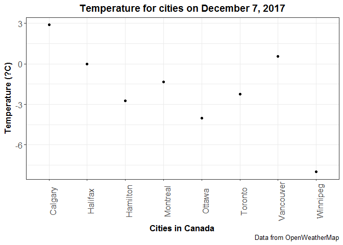

STAT547 Homework \#10
================

### Make API queries "by hand" using httr

Load the following packages:

``` r
library(httr)
library(purrr)
library(glue)
library(tidyverse)
library(ggplot2)
library(dplyr)
library(plyr)
library(knitr)
library(forcats)
```

### Call an API from OpenWeatherData

Sign up [here](https://home.openweathermap.org/users/sign_up) to request an API from OpenWeatherData.

``` r
my_apikey <- "insert_your_api_key_here"

#Current weather in several Canadian cities
weather_severalcities <- GET(glue("http://api.openweathermap.org/data/2.5/group?id=6173331,6167865,6077243,5969423,5913490,6183235,6094817,5969785&units=metric&APPID={my_apikey}")) 
#changed the units from the default which is Kelvin to metric which is Celsius
#`GET` is used to retrieve resources

#You must input several city ID's into `weather_severalcities` in order to get weather data for the specific cities you want. The API query above includes data for the following cities:
vancouver_id <- "6173331" #Vancouver,CA
toronto_id <- "6167865" #Toronto,CA
montreal_id <- "6077243" #Montreal,CA
halifax_id <- "5969423" #Halifax,CA
calgary_id <- "5913490" #Calgary,CA
winnipeg_id <- "6183235" #Winnipeg,CA
ottawa_id <- "6094817" #Ottawa,CA
hamilton_id <- "5969785" #Hamilton,CA
#A full list of city ID (city.list.json.gz) can be downloaded here http://bulk.openweathermap.org/sample/


status_code(weather_severalcities) #status code of 200 means that the call was successful 
```

    ## [1] 200

``` r
severalcities_result <- content(weather_severalcities)
nchar(severalcities_result) #number of characters
```

    ##  cnt list 
    ##    1 3891

``` r
class(severalcities_result) #this is a list
```

    ## [1] "list"

``` r
length(severalcities_result) #the list is of length 2
```

    ## [1] 2

``` r
View(severalcities_result)

str(weather_severalcities)
```

    ## List of 10
    ##  $ url        : chr "http://api.openweathermap.org/data/2.5/group?id=6173331,6167865,6077243,5969423,5913490,6183235,6094817,5969785"| __truncated__
    ##  $ status_code: int 200
    ##  $ headers    :List of 9
    ##   ..$ server                          : chr "openresty"
    ##   ..$ date                            : chr "Fri, 08 Dec 2017 05:36:44 GMT"
    ##   ..$ content-type                    : chr "application/json; charset=utf-8"
    ##   ..$ content-length                  : chr "3392"
    ##   ..$ connection                      : chr "keep-alive"
    ##   ..$ x-cache-key                     : chr "/data/2.5/group?APPID=89f918f4bb7c078e3f2fe2392de4fe3c&id=6173331,6167865,6077243,5969423,5913490,6183235,60948"| __truncated__
    ##   ..$ access-control-allow-origin     : chr "*"
    ##   ..$ access-control-allow-credentials: chr "true"
    ##   ..$ access-control-allow-methods    : chr "GET, POST"
    ##   ..- attr(*, "class")= chr [1:2] "insensitive" "list"
    ##  $ all_headers:List of 1
    ##   ..$ :List of 3
    ##   .. ..$ status : int 200
    ##   .. ..$ version: chr "HTTP/1.1"
    ##   .. ..$ headers:List of 9
    ##   .. .. ..$ server                          : chr "openresty"
    ##   .. .. ..$ date                            : chr "Fri, 08 Dec 2017 05:36:44 GMT"
    ##   .. .. ..$ content-type                    : chr "application/json; charset=utf-8"
    ##   .. .. ..$ content-length                  : chr "3392"
    ##   .. .. ..$ connection                      : chr "keep-alive"
    ##   .. .. ..$ x-cache-key                     : chr "/data/2.5/group?APPID=89f918f4bb7c078e3f2fe2392de4fe3c&id=6173331,6167865,6077243,5969423,5913490,6183235,60948"| __truncated__
    ##   .. .. ..$ access-control-allow-origin     : chr "*"
    ##   .. .. ..$ access-control-allow-credentials: chr "true"
    ##   .. .. ..$ access-control-allow-methods    : chr "GET, POST"
    ##   .. .. ..- attr(*, "class")= chr [1:2] "insensitive" "list"
    ##  $ cookies    :'data.frame': 0 obs. of  7 variables:
    ##   ..$ domain    : logi(0) 
    ##   ..$ flag      : logi(0) 
    ##   ..$ path      : logi(0) 
    ##   ..$ secure    : logi(0) 
    ##   ..$ expiration:Classes 'POSIXct', 'POSIXt'  num(0) 
    ##   ..$ name      : logi(0) 
    ##   ..$ value     : logi(0) 
    ##  $ content    : raw [1:3392] 7b 22 63 6e ...
    ##  $ date       : POSIXct[1:1], format: "2017-12-08 05:36:44"
    ##  $ times      : Named num [1:6] 0 0.047 0.125 0.125 0.485 0.485
    ##   ..- attr(*, "names")= chr [1:6] "redirect" "namelookup" "connect" "pretransfer" ...
    ##  $ request    :List of 7
    ##   ..$ method    : chr "GET"
    ##   ..$ url       :Classes 'glue', 'character'  chr "http://api.openweathermap.org/data/2.5/group?id=6173331,6167865,6077243,5969423,5913490,6183235,6094817,5969785"| __truncated__
    ##   ..$ headers   : Named chr "application/json, text/xml, application/xml, */*"
    ##   .. ..- attr(*, "names")= chr "Accept"
    ##   ..$ fields    : NULL
    ##   ..$ options   :List of 3
    ##   .. ..$ useragent: chr "libcurl/7.56.0 r-curl/3.0 httr/1.3.1"
    ##   .. ..$ cainfo   : chr "C:/PROGRA~1/R/R-34~1.2/etc/curl-ca-bundle.crt"
    ##   .. ..$ httpget  : logi TRUE
    ##   ..$ auth_token: NULL
    ##   ..$ output    : list()
    ##   .. ..- attr(*, "class")= chr [1:2] "write_memory" "write_function"
    ##   ..- attr(*, "class")= chr "request"
    ##  $ handle     :Class 'curl_handle' <externalptr> 
    ##  - attr(*, "class")= chr "response"

List of data frames for the different cities.

``` r
#data frame for the weather data from Vancouver
weather_df_1 <- lapply(severalcities_result, function(x){
  df <- data_frame(City = severalcities_result$list[[1]]$name,
                   Longitude = severalcities_result$list[[1]]$coord$lon,
                   Latitude = severalcities_result$list[[1]]$coord$lat,
                   Temperature = severalcities_result$list[[1]]$main$temp,
                   Pressure = severalcities_result$list[[1]]$main$pressure,
                   Humidity = severalcities_result$list[[1]]$main$humidity,
                   Temp_min = severalcities_result$list[[1]]$main$temp_min,
                   Temp_max = severalcities_result$list[[1]]$main$temp_max,
                   Wind_speed = severalcities_result$list[[1]]$wind$speed)
}) %>% bind_rows()

#data frame for the weather data from Toronto
weather_df_2 <- lapply(severalcities_result, function(x){
  df <- data_frame(City = severalcities_result$list[[2]]$name,
                   Longitude = severalcities_result$list[[2]]$coord$lon,
                   Latitude = severalcities_result$list[[2]]$coord$lat,
                   Temperature = severalcities_result$list[[2]]$main$temp,
                   Pressure = severalcities_result$list[[2]]$main$pressure,
                   Humidity = severalcities_result$list[[2]]$main$humidity,
                   Temp_min = severalcities_result$list[[2]]$main$temp_min,
                   Temp_max = severalcities_result$list[[2]]$main$temp_max,
                   Wind_speed = severalcities_result$list[[2]]$wind$speed)
}) %>% bind_rows()

#data frame for the weather data from Montreal
weather_df_3 <- lapply(severalcities_result, function(x){
  df <- data_frame(City = severalcities_result$list[[3]]$name,
                   Longitude = severalcities_result$list[[3]]$coord$lon,
                   Latitude = severalcities_result$list[[3]]$coord$lat,
                   Temperature = severalcities_result$list[[3]]$main$temp,
                   Pressure = severalcities_result$list[[3]]$main$pressure,
                   Humidity = severalcities_result$list[[3]]$main$humidity,
                   Temp_min = severalcities_result$list[[3]]$main$temp_min,
                   Temp_max = severalcities_result$list[[3]]$main$temp_max,
                   Wind_speed = severalcities_result$list[[3]]$wind$speed)
}) %>% 
  bind_rows()

#data frame for the weather data from Halifax
weather_df_4 <- lapply(severalcities_result, function(x){
  df <- data_frame(City = severalcities_result$list[[4]]$name,
                   Longitude = severalcities_result$list[[4]]$coord$lon,
                   Latitude = severalcities_result$list[[4]]$coord$lat,
                   Temperature = severalcities_result$list[[4]]$main$temp,
                   Pressure = severalcities_result$list[[4]]$main$pressure,
                   Humidity = severalcities_result$list[[4]]$main$humidity,
                   Temp_min = severalcities_result$list[[4]]$main$temp_min,
                   Temp_max = severalcities_result$list[[4]]$main$temp_max,
                   Wind_speed = severalcities_result$list[[4]]$wind$speed)
}) %>% bind_rows()

#data frame for the weather data from Calgary
weather_df_5 <- lapply(severalcities_result, function(x){
  df <- data_frame(City = severalcities_result$list[[5]]$name,
                   Longitude = severalcities_result$list[[5]]$coord$lon,
                   Latitude = severalcities_result$list[[5]]$coord$lat,
                   Temperature = severalcities_result$list[[5]]$main$temp,
                   Pressure = severalcities_result$list[[5]]$main$pressure,
                   Humidity = severalcities_result$list[[5]]$main$humidity,
                   Temp_min = severalcities_result$list[[5]]$main$temp_min,
                   Temp_max = severalcities_result$list[[5]]$main$temp_max,
                   Wind_speed = severalcities_result$list[[5]]$wind$speed)
}) %>% bind_rows()

#data frame for the weather data from Winnipeg
weather_df_6 <- lapply(severalcities_result, function(x){
  df <- data_frame(City = severalcities_result$list[[6]]$name,
                   Longitude = severalcities_result$list[[6]]$coord$lon,
                   Latitude = severalcities_result$list[[6]]$coord$lat,
                   Temperature = severalcities_result$list[[6]]$main$temp,
                   Pressure = severalcities_result$list[[6]]$main$pressure,
                   Humidity = severalcities_result$list[[6]]$main$humidity,
                   Temp_min = severalcities_result$list[[6]]$main$temp_min,
                   Temp_max = severalcities_result$list[[6]]$main$temp_max,
                   Wind_speed = severalcities_result$list[[6]]$wind$speed)
}) %>% bind_rows()

#data frame for the weather data from Ottawa
weather_df_7 <- lapply(severalcities_result, function(x){
  df <- data_frame(City = severalcities_result$list[[7]]$name,
                   Longitude = severalcities_result$list[[7]]$coord$lon,
                   Latitude = severalcities_result$list[[7]]$coord$lat,
                   Temperature = severalcities_result$list[[7]]$main$temp,
                   Pressure = severalcities_result$list[[7]]$main$pressure,
                   Humidity = severalcities_result$list[[7]]$main$humidity,
                   Temp_min = severalcities_result$list[[7]]$main$temp_min,
                   Temp_max = severalcities_result$list[[7]]$main$temp_max,
                   Wind_speed = severalcities_result$list[[7]]$wind$speed)
}) %>% bind_rows()

#data frame for the weather data from Hamilton
weather_df_8 <- lapply(severalcities_result, function(x){
  df <- data_frame(City = severalcities_result$list[[8]]$name,
                   Longitude = severalcities_result$list[[8]]$coord$lon,
                   Latitude = severalcities_result$list[[8]]$coord$lat,
                   Temperature = severalcities_result$list[[8]]$main$temp,
                   Pressure = severalcities_result$list[[8]]$main$pressure,
                   Humidity = severalcities_result$list[[8]]$main$humidity,
                   Temp_min = severalcities_result$list[[8]]$main$temp_min,
                   Temp_max = severalcities_result$list[[8]]$main$temp_max,
                   Wind_speed = severalcities_result$list[[8]]$wind$speed)
}) %>% bind_rows()
```

Now I must recursively join the list of data frames: 

/*I found [this](https://www.rdocumentation.org/packages/plyr/versions/1.8.4/topics/join_all) website particularly helpful with figuring out how to join multiple data frames

``` r
weather_cities_df <- join_all(list(
  weather_df_1, 
  weather_df_2, 
  weather_df_3, 
  weather_df_4, 
  weather_df_5, 
  weather_df_6, 
  weather_df_7, 
  weather_df_8),
  by = "City", type = "full", match = "all")

#Now I need to remove duplicates from the `weather_cities_df` data frame using the function `distinct()`
weather_cities_df <- distinct(weather_cities_df,
                              City,
                              Longitude,
                              Latitude,
                              Temperature,
                              Pressure,
                              Humidity,
                              Temp_min,
                              Temp_max,
                              Wind_speed)
kable(weather_cities_df, align = 'c', format = 'html')
```

<table>
<thead>
<tr>
<th style="text-align:center;">
City
</th>
<th style="text-align:center;">
Longitude
</th>
<th style="text-align:center;">
Latitude
</th>
<th style="text-align:center;">
Temperature
</th>
<th style="text-align:center;">
Pressure
</th>
<th style="text-align:center;">
Humidity
</th>
<th style="text-align:center;">
Temp\_min
</th>
<th style="text-align:center;">
Temp\_max
</th>
<th style="text-align:center;">
Wind\_speed
</th>
</tr>
</thead>
<tbody>
<tr>
<td style="text-align:center;">
Vancouver
</td>
<td style="text-align:center;">
-123.12
</td>
<td style="text-align:center;">
49.25
</td>
<td style="text-align:center;">
0.55
</td>
<td style="text-align:center;">
1034
</td>
<td style="text-align:center;">
100
</td>
<td style="text-align:center;">
-2
</td>
<td style="text-align:center;">
4
</td>
<td style="text-align:center;">
2.6
</td>
</tr>
<tr>
<td style="text-align:center;">
Toronto
</td>
<td style="text-align:center;">
-79.42
</td>
<td style="text-align:center;">
43.70
</td>
<td style="text-align:center;">
-2.25
</td>
<td style="text-align:center;">
1014
</td>
<td style="text-align:center;">
63
</td>
<td style="text-align:center;">
-3
</td>
<td style="text-align:center;">
-1
</td>
<td style="text-align:center;">
9.8
</td>
</tr>
<tr>
<td style="text-align:center;">
Montreal
</td>
<td style="text-align:center;">
-73.59
</td>
<td style="text-align:center;">
45.51
</td>
<td style="text-align:center;">
-1.35
</td>
<td style="text-align:center;">
1010
</td>
<td style="text-align:center;">
68
</td>
<td style="text-align:center;">
-2
</td>
<td style="text-align:center;">
-1
</td>
<td style="text-align:center;">
7.2
</td>
</tr>
<tr>
<td style="text-align:center;">
Halifax
</td>
<td style="text-align:center;">
-63.57
</td>
<td style="text-align:center;">
44.65
</td>
<td style="text-align:center;">
0.00
</td>
<td style="text-align:center;">
1009
</td>
<td style="text-align:center;">
100
</td>
<td style="text-align:center;">
0
</td>
<td style="text-align:center;">
0
</td>
<td style="text-align:center;">
2.6
</td>
</tr>
<tr>
<td style="text-align:center;">
Calgary
</td>
<td style="text-align:center;">
-114.09
</td>
<td style="text-align:center;">
51.05
</td>
<td style="text-align:center;">
2.90
</td>
<td style="text-align:center;">
1028
</td>
<td style="text-align:center;">
24
</td>
<td style="text-align:center;">
-1
</td>
<td style="text-align:center;">
7
</td>
<td style="text-align:center;">
2.1
</td>
</tr>
<tr>
<td style="text-align:center;">
Winnipeg
</td>
<td style="text-align:center;">
-97.15
</td>
<td style="text-align:center;">
49.88
</td>
<td style="text-align:center;">
-8.00
</td>
<td style="text-align:center;">
1014
</td>
<td style="text-align:center;">
92
</td>
<td style="text-align:center;">
-8
</td>
<td style="text-align:center;">
-8
</td>
<td style="text-align:center;">
3.6
</td>
</tr>
<tr>
<td style="text-align:center;">
Ottawa
</td>
<td style="text-align:center;">
-75.70
</td>
<td style="text-align:center;">
45.41
</td>
<td style="text-align:center;">
-4.00
</td>
<td style="text-align:center;">
1011
</td>
<td style="text-align:center;">
85
</td>
<td style="text-align:center;">
-4
</td>
<td style="text-align:center;">
-4
</td>
<td style="text-align:center;">
3.6
</td>
</tr>
<tr>
<td style="text-align:center;">
Hamilton
</td>
<td style="text-align:center;">
-79.95
</td>
<td style="text-align:center;">
43.23
</td>
<td style="text-align:center;">
-2.73
</td>
<td style="text-align:center;">
1014
</td>
<td style="text-align:center;">
63
</td>
<td style="text-align:center;">
-4
</td>
<td style="text-align:center;">
-1
</td>
<td style="text-align:center;">
7.7
</td>
</tr>
</tbody>
</table>
Now to test to be sure the data has been successfully downloaded and cleaned.

``` r
#Plot of temperatures for the different cities
(weather_cities_plot <- weather_cities_df %>%
  ggplot(aes(x = City,
             y = Temperature)) +
  geom_point() +
   theme_bw()+
   theme(axis.title = element_text(size=13, face='bold'),
         axis.text.x = element_text(size=12, angle=90),
        axis.text.y = element_text(size=12),
        plot.title = element_text(size=14, face="bold", hjust = 0.5)) +
   labs(x = "Cities in Canada", y = "Temperature (?C)", title = "Temperature for cities on December 7, 2017", caption = "Data from OpenWeatherMap"))
```



``` r
#Determine which cities have a temperature above zero degrees Celsius and a wind speed less than 5.0 meters/sec
(test1 <- weather_cities_df %>%
  filter(Temperature > 0, Wind_speed <5.0) %>%
  group_by(City) %>%
    kable())
```

| City      |  Longitude|  Latitude|  Temperature|  Pressure|  Humidity|  Temp\_min|  Temp\_max|  Wind\_speed|
|:----------|----------:|---------:|------------:|---------:|---------:|----------:|----------:|------------:|
| Vancouver |    -123.12|     49.25|         0.55|      1034|       100|         -2|          4|          2.6|
| Calgary   |    -114.09|     51.05|         2.90|      1028|        24|         -1|          7|          2.1|

``` r
#as you can see only Vancouver, Halifax, and Calgary fit the requirements
```
